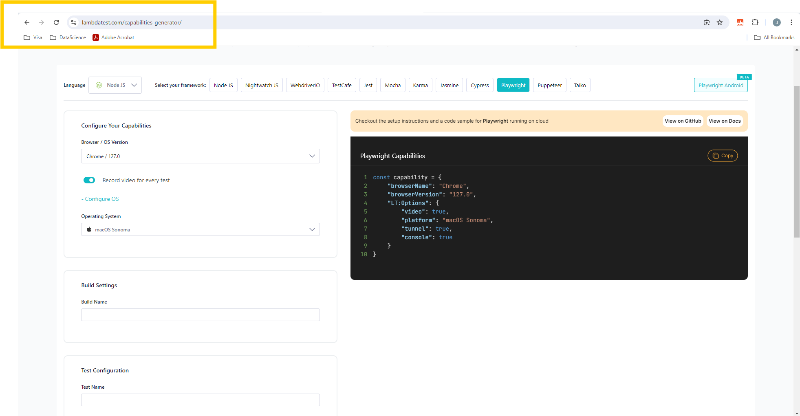

# How To Handle Frames In Playwright TypeScript

This repository contains code to demo Playwright testing 🎭

The entire testing was performed on local gird as well as [LambdaTest Cloud Grid](http://www.lambdatest.com?fp_ref=jaydeep88)
## Version Check

The code has been fully tested on the below versions

🐋 Node  v20.16.0

🐍 NPX version 10.8.2

🎭 Version 1.45.3

## Env File
The ``.env`` file needs to be amended to run the test on cloud grid by providing the username and access key

## Running the tests locally 
Amend the projects array in the``playwright.config.ts`` to include the browser engine of your choice. 
If you choose chromium the command to run test is

```javascript
{
   name: 'chromium',
   use: { ...devices['Desktop Chrome'] },
}
```

``npx playwright test --project=chromium``

## Running the tests on cloud grid on Windows 11 & Chrome
Amend the ``.env`` file to add the cloud grid username and access key.

Amend the projects array in the``playwright.config.ts`` to 
```javascript
{
      name: "chrome:latest:Windows 10@lambdatest",     
},
```

## Running the tests on cloud grid on macOs Sonoma & Chrome
Amend the ``.env`` file to add the cloud grid username and access key.

Amend the projects array in the``playwright.config.ts`` to 
```javascript
{
      name: "chrome:latest:macOs Sonoma@lambdatest",
},
```

Amend the projects array in the``playwright.config.ts`` to operating system & browser verison of your choice.
Capabilities can be generated using the [LambdaTest capabilities generator](https://www.lambdatest.com/capabilities-generator/) as per the test setup we require. 

